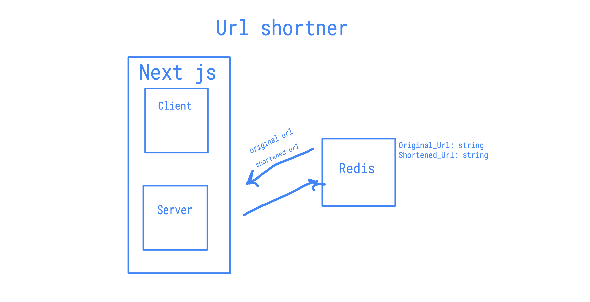
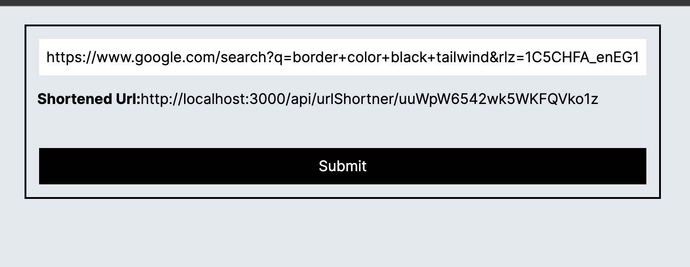

## Getting Started

First, run the development server:

```bash
npm run dev
# or
yarn dev
# or
pnpm dev
# or
bun dev
```

Open [http://localhost:3000](http://localhost:3000) with your browser to see the result.


## Project Architecture Desgin

<p>
   
</p>


## Description

This project is built with nextJS, frontend and backend both runs in the same project.

the user specifies the url in the input and then send the request to the backend, the response will be the shortened version of this url.

Redis is used to store the data, you can add redis extension in VScode to run it locally. 

use ``` redis-server ``` to run redis server. 

## Linting

Eslint prettier were added to enforce certain code styling.


## screenshots

After running the project you will see this simple form.

<p>
   
</p>